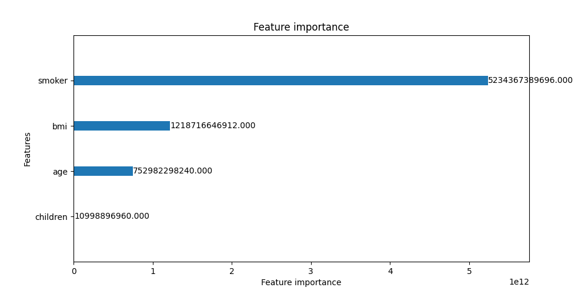

### Choice of objective functions

Squared error wins as an objective function; I tried tweedie which performed worse. The optimal set of hyperparmaters discovered are below with a validation RMSE of 3836.

    objective: regression
    metric: rmse
    verbose: -1
    n_jobs: 6
    learning_rate: 0.009875772374731435
    feature_pre_filter: False
    lambda_l1: 0.01631989246318018
    lambda_l2: 0.001287128443517099
    num_leaves: 8
    feature_fraction: 0.8999999999999999
    bagging_fraction: 1.0
    bagging_freq: 0
    min_child_samples: 20
    num_boost_rounds: 414
    
With this model, feature importance looks as follows:
